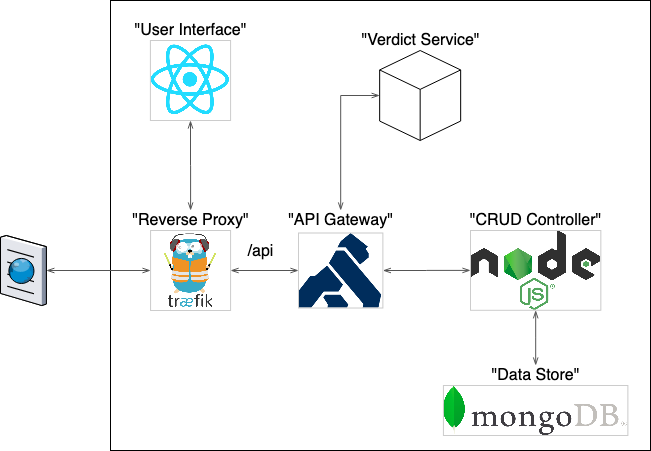

# ENSIAS IT Battleground

## Description

## Motivation

## Features

We distinct 3 types of users:

- **Admin**: The superuser.

- **Participant**: A participant in a contest. A participant cannot exist without a contest, and its lifetime depends on the contest's lifetime.

- **Judge**: A judge in a contest. A judge cannot exist without a contest, and its lifetime depends on the contest's lifetime.

The following table describes the rights (ie. CRUD) every user has on all resources:

|             | Contest | Participant | Judge | Problem | Submission | Clarification
| ----------- | ------- | ----------- | ----- | ------- | ---------- | -------------
| Admin       | CRUD    | CRUD        | CRUD  | CRUD    | CRUD       | CRUD
| Participant | -R--    | -R--        | ----  | -R--    | CR--       | CR--
| Judge       | -R--    | ----        | ----  | -R--    | -RU-       | CR--

## Architecture

## How to install
